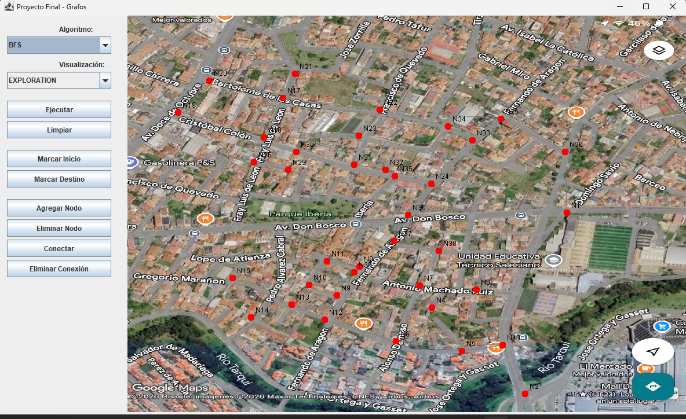
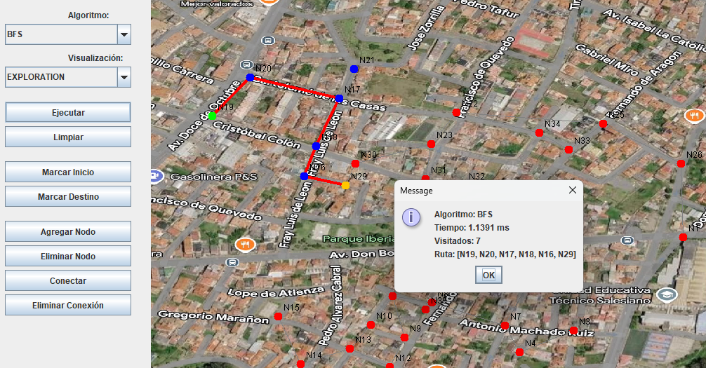
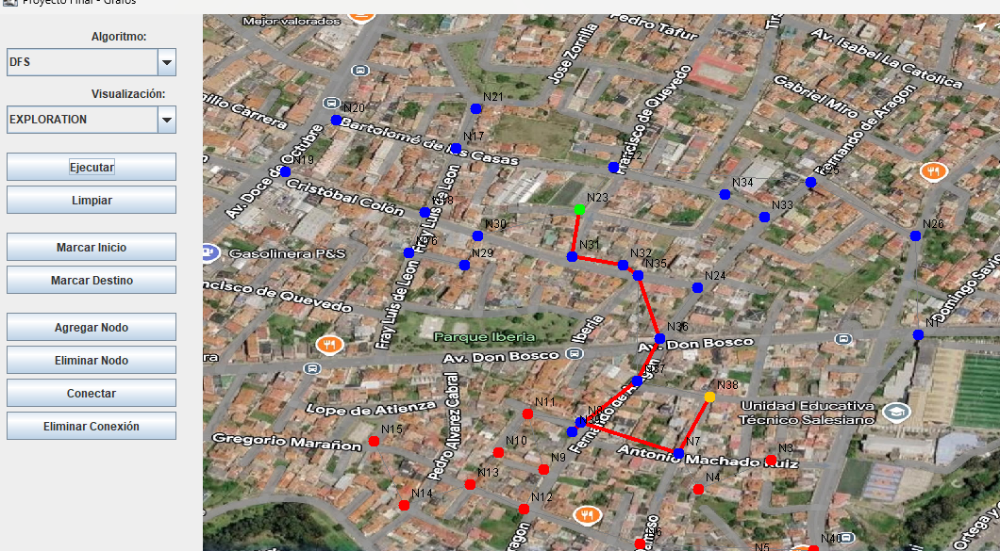

#  Proyecto Final - Búsqueda de Rutas con BFS y DFS


##  Integrantes

- Valeria Jimenez

**Correos institucionales**

- vjimenezp@est.ups.edu.ec

**Universidad:** Universidad Politécnica Salesiana

**Carrera:** Computación

**Asignatura:** Estructura de Datos

**Docente:** Ing Pablo Andres Torres

---

#  Índice

- Objetivo
- Descripción del problema
- Marco teórico
- Tecnologías utilizadas
- Diagrama UML
- Arquitectura del proyecto
- Estructura del proyecto
- Funcionamiento del sistema
- Capturas del programa
- Explicación del algoritmo BFS
- Comparación entre BFS y DFS
- Respuestas de análisis
- Conclusiones
- Recomendaciones
- Aplicaciones futuras

---

#  Objetivo

El objetivo de este proyecto fue desarrollar una aplicación en Java que permita representar un mapa mediante un grafo para encontrar rutas entre dos puntos utilizando los algoritmos BFS (Breadth First Search) y DFS (Depth First Search). Además, se implementó una interfaz gráfica para que el usuario pueda visualizar el recorrido de manera sencilla e interactiva.

---

#  Descripción del problema

Actualmente existen muchas aplicaciones que necesitan encontrar rutas entre diferentes ubicaciones, como Google Maps o aplicaciones de transporte. Para resolver este problema se utilizan grafos, donde cada intersección se representa como un nodo y cada calle como una conexión entre ellos.

En este proyecto se desarrolló un sistema que permite al usuario seleccionar un punto de inicio y un punto de destino sobre un mapa. Posteriormente, el programa ejecuta los algoritmos BFS o DFS para encontrar una ruta válida y mostrarla gráficamente.

---

#  Marco teórico

## ¿Qué es un grafo?

Un grafo es una estructura de datos formada por un conjunto de nodos (vértices) y conexiones (aristas). Los grafos permiten representar relaciones entre objetos y son ampliamente utilizados en mapas, redes sociales, videojuegos y sistemas de navegación.

---

## Breadth First Search (BFS)

BFS significa **Breadth First Search** o **Búsqueda en Anchura**.

Este algoritmo utiliza una **cola (Queue)** para recorrer primero todos los nodos vecinos antes de continuar con los siguientes niveles.

### Ventajas

- Encuentra la ruta más corta cuando todas las aristas tienen el mismo peso.
- Explora el mapa de forma organizada.

### Desventajas

- Puede consumir más memoria que DFS.

---

## Depth First Search (DFS)

DFS significa **Depth First Search** o **Búsqueda en Profundidad**.

Este algoritmo utiliza una **pila (Stack)** y explora completamente un camino antes de regresar para buscar otras alternativas.

### Ventajas

- Consume menos memoria en algunos casos.
- Es sencillo de implementar.

### Desventajas

- No garantiza encontrar la ruta más corta.

---

#  Tecnologías utilizadas

- Java
- Swing
- Programación Orientada a Objetos
- Patrón MVC
- Grafos
- BFS
- DFS
- Git
- GitHub

---

### Explicación

El proyecto sigue el patrón **Modelo Vista Controlador (MVC)**.

### Modelo

Contiene la lógica y las estructuras de datos del sistema.

Clases principales:

- Graph
- Node
- MapPoint
- PathResult

### Vista

Representa toda la interfaz gráfica.

Clases:

- MainFrame
- MapPanel

### Controlador

Gestiona las acciones del usuario y ejecuta los algoritmos de búsqueda.

Clase:

- MapController

---

#  Arquitectura del proyecto

El sistema fue desarrollado utilizando el patrón MVC para separar correctamente las responsabilidades.

- **Modelo:** almacena la información del grafo.
- **Vista:** muestra el mapa y recibe las acciones del usuario.
- **Controlador:** conecta la vista con el modelo y ejecuta BFS y DFS.

Esta arquitectura facilita el mantenimiento y la escalabilidad del proyecto.

---

#  Estructura del proyecto

```text
src
│
├── app
│
├── controllers
│
├── models
│
├── resources
│
├── structures
│   ├── graphs
│   ├── implementations
│   └── node
│
└── views
```

---

#  Funcionamiento del sistema

Al ejecutar el programa se carga un mapa junto con todos sus nodos y conexiones.

El usuario puede realizar las siguientes acciones:

- Seleccionar un nodo de inicio.
- Seleccionar un nodo de destino.
- Ejecutar BFS.
- Ejecutar DFS.
- Visualizar únicamente la ruta.
- Visualizar todo el recorrido del algoritmo.
- Agregar nuevos nodos.
- Eliminar nodos.
- Conectar nodos.
- Eliminar conexiones.
- Limpiar la visualización.

Después de ejecutar el algoritmo se muestran:

- Tiempo de ejecución.
- Cantidad de nodos visitados.
- Ruta encontrada.

---

#  Capturas del programa

## Captura 1



---

## Captura 2



---
## Captura 3


#  Explicación del algoritmo BFS

Cuando el usuario presiona el botón **Ejecutar**, el controlador obtiene el nodo inicial y el nodo destino.

Posteriormente:

1. Se crea una cola.
2. Se marca el nodo inicial como visitado.
3. Se recorren todos sus vecinos.
4. Se guarda el padre de cada nodo.
5. Cuando se encuentra el destino se reconstruye la ruta.
6. Finalmente la ruta es enviada a la vista para ser dibujada sobre el mapa.

Este algoritmo garantiza encontrar la ruta con menor cantidad de aristas cuando todas las conexiones tienen el mismo costo.

---

#  Comparación entre BFS y DFS

| Característica | BFS | DFS |
|----------------|-----|-----|
| Estructura utilizada | Cola | Pila |
| Ruta más corta | Sí | No siempre |
| Tipo de recorrido | Por niveles | En profundidad |
| Memoria | Mayor | Menor |
| Aplicación | Caminos mínimos | Exploración |

---

## Resultados obtenidos

| Caso | Algoritmo | Inicio | Destino | Tiempo | Nodos visitados |
|------|-----------|---------|----------|---------|-----------------|
| 1 | BFS | N19 | N29 | 1.13 | N19-N20-N17-n18-N16-N29 |
| 2 | DFS | N23 | N38 | 0.98 | M31-N32-N35-N36-N37-N39-N7 |

---

#  Respuestas de análisis

## ¿Qué diferencias observaste entre BFS y DFS?

Durante las pruebas se pudo observar que BFS explora primero todos los nodos cercanos al punto inicial, mientras que DFS sigue una sola ruta hasta donde puede antes de regresar.

---

## ¿Cuál encontró la mejor ruta?

En la mayoría de las pruebas BFS encontró la ruta más corta porque recorre el grafo por niveles. DFS también encontró una ruta válida, aunque en algunos casos fue más larga.

---

## ¿Cuál fue más rápido?

La diferencia de tiempo fue muy pequeña debido a que el mapa utilizado no contiene una gran cantidad de nodos. Sin embargo, ambos algoritmos tuvieron un buen rendimiento.

---

## ¿Qué modo de visualización fue más útil?

El modo **EXPLORATION** permitió observar cómo el algoritmo visita cada nodo antes de encontrar la solución.

El modo **FINAL_PATH** facilitó visualizar únicamente la ruta final obtenida.

---

#  Conclusiones

Este proyecto permitió comprender de una manera mucho más práctica el funcionamiento de los grafos y de los algoritmos BFS y DFS. Además, ayudó a reforzar conocimientos sobre programación orientada a objetos, estructuras de datos y el patrón MVC.

Aunque durante el desarrollo aparecieron varios errores de implementación y conexión entre las clases, cada uno fue corregido hasta conseguir un sistema completamente funcional. Al finalizar el proyecto se logró visualizar correctamente las rutas sobre el mapa y comparar el comportamiento de ambos algoritmos.

---

#  Recomendaciones

- Agregar persistencia mediante archivos.
- Permitir cargar diferentes mapas.
- Incorporar zoom sobre el mapa.
- Agregar pesos a las aristas para utilizar algoritmos como Dijkstra.
- Mejorar el diseño visual de la interfaz.

---

#  Aplicaciones futuras

Este proyecto puede adaptarse para desarrollar aplicaciones como:

- Sistemas GPS.
- Navegadores de rutas.
- Videojuegos.
- Robots móviles.
- Redes de transporte.
- Redes de comunicación.
- Sistemas de logística.
